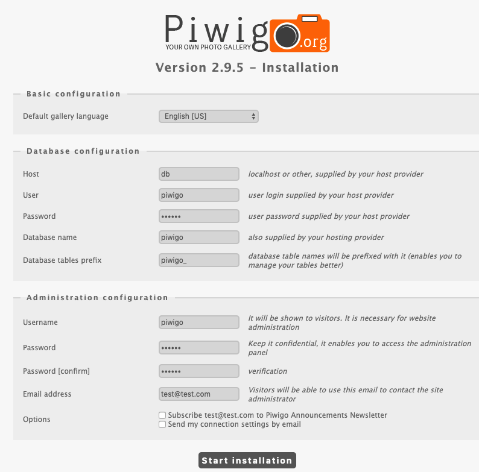

# piwigo docker
a piwigo docker image

## Content 
* mysql 5
* linuxserver/piwigo (https://github.com/linuxserver/docker-piwigo)

## Start
Make sure you have docker-compose installed

```
docker-compose up -d
```

Below services will start:
* mysql 5
database: piwigo
user: piwigo
password: piwigo

* piwigo (from linuxserver/piwigo)
access port on : 8899

## Shutdown

```
docker-compose down
```
## Install Piwigo

Open Piwigo setup page on: http://localhost:8899

Fill the form with below database configuration 
* Host: db 					(the docker service name)
* User: piwigo 				(mysql db user)
* Password: piwigo 			(mysql db password)
* Database name: piwigo 	(mysql db name)

and setup your Administration configuration

then click "*Start installation*".



Everything should be ready in seconds.


## Costomization

You may edit the docker-compose.yml file to costomize your setup.

## Further reading

* 欢迎访问厦门暗游的技术博客 https://xmanyou.com/
* Piwigo : https://piwigo.org/
